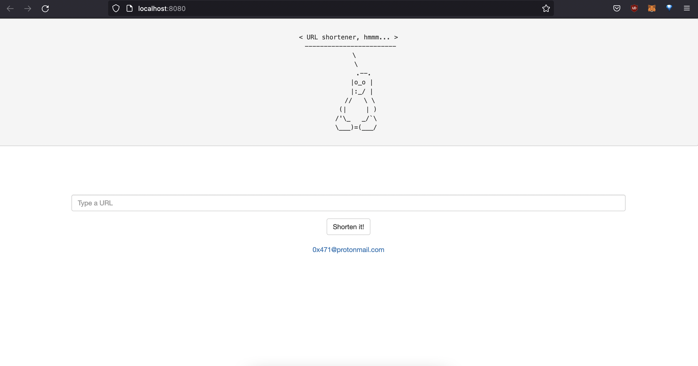

# URL Shortener

This website is a GoLang alternative for https://bitly.com/. 

## How it works?
There is an sqlite database to store URLs. First, it checks if URL is hashed (adler-32 checksum algorithm) and inserted into database before. If it is not inserted before, it hashes the url and inserts into database. In general that is how it works.

